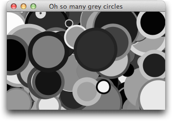
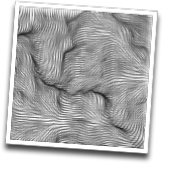

# Quil

[](https://clojars.org/quil)
[](https://github.com/quil/quil/actions/workflows/test.yaml)

http://quil.info


Quil looked up in shock to see Bigelow floating high in the clouds, his balloons rustling merrily in the wind. He gruffed to her from above, "This truly is a party!". Image after image, vista after vista, passed furry Bige's wide-open eyes. A deep underlying beauty unfolded before him. A flock of bezier gulls whistled past. Beneath his dangling paws a distant shepherd called his scribbly sheep in for re-sketching. Goading him from the distance, wooden letters of so many different fonts mocked **PERLIN-WOULD** from the hilltops.

This truly was an amazing place. Here, dreams and reality had been drawn together - all in one Process. "*_Why* would I ever leave?" he barked with joy! *_Why* indeed!

## (mix Processing Clojure)

In one hand Quil holds Processing, a carefully crafted API for making drawing and animation extremely easy to get your biscuit-loving chops around. In the other she clutches Clojure, an interlocking suite of exquisite language abstractions forged by an army of hammocks and delicately wrapped in flowing silky parens of un-braided joy.

In one swift, skilled motion, Quil throws them both high into the air. In a dusty cloud of pixels, they bond instantly and fly off into the distance painting their way with immutable trails of brilliant colour. Moments later, you see them swiftly return and hover nearby. Your very own ride to Perlinwould awaits. Summon the winds and ride well, my friend.

## Requirements

Quil works with Clojure 1.10 and ClojureScript 1.10.x.

Current released version `4.3.1323` is compatible JDK 17+ and supports Linux amd64,aarch64 and macOS M1/M2/x86_64 architectures.

## Installation

Create sample project using a Leiningen [Quil Template](https://github.com/quil/quil-templates):
```bash
lein new quil hello-quil
```
Then go to `hello-quil/src/hello-quil/core.clj` file and run it!

There are also `deps-new` templates available for creating a [sketchbook](https://github.com/quil/sketchbook-template) with the Clojure CLI.

If you like adding libraries manually - you simply need to add Quil as a dependency to `project.clj`:

```clojure
[quil "4.3.1323"]
```

or for Clojure CLI `deps.edn`

```clojure
quil/quil {:mvn/version "4.3.1323"}
```

Then to pull in all of Quil's silky goodness, just add the following to your `ns` declaration:

```clojure
(:require [quil.core :as q])
```

For more detailed instructions [head over to the wiki](https://github.com/quil/quil/wiki/Installing).

## Getting Started

Using Quil is as easy as eating chocolate digestives. You just need to grok three basic concepts:

* The Setup fn
* The Draw fn
* The Sketch

If `setup` and `draw` are hard working *artistic gladiators*, `sketch` is the *arena* in which they battle for the glory of art. However, they don't actually fight each other - they work as a team - relentlessly spilling colour all over the arena sands. The crowds roar for messy fight.

`setup` lays all the groundwork and is called only once at the start. `draw`, on the other hand, is called immediately after `setup` has completed, and then repeatedly until you summon it to stop. When you create a `sketch` and name your `setup` and `draw` fns, the fun automatically starts.

A simple example is called for:

```clojure
(ns for-the-glory-of-art
  (:require [quil.core :as q]))

(defn setup []
  (q/frame-rate 1)                    ;; Set framerate to 1 FPS
  (q/background 200))                 ;; Set the background colour to
                                      ;; a nice shade of grey.
(defn draw []
  (q/stroke (q/random 255))             ;; Set the stroke colour to a random grey
  (q/stroke-weight (q/random 10))       ;; Set the stroke thickness randomly
  (q/fill (q/random 255))               ;; Set the fill colour to a random grey

  (let [diam (q/random 100)             ;; Set the diameter to a value between 0 and 100
        x    (q/random (q/width))       ;; Set the x coord randomly within the sketch
        y    (q/random (q/height))]     ;; Set the y coord randomly within the sketch
    (q/ellipse x y diam diam)))         ;; Draw a circle at x y with the correct diameter

(q/defsketch example                  ;; Define a new sketch named example
  :title "Oh so many grey circles"    ;; Set the title of the sketch
  :settings #(q/smooth 2)             ;; Turn on anti-aliasing
  :setup setup                        ;; Specify the setup fn
  :draw draw                          ;; Specify the draw fn
  :size [323 200])                    ;; You struggle to beat the golden ratio
```



Feast your eyes on this beauty.

You're witnessing `setup`, `settings`, `draw` and `sketch` working in complete harmony. See how `settings` turns on anti-aliasing, `setup` sets the framerate to 1 FPS and sets the background colour to a nice shade of grey. `draw` then kicks into action. It chooses random stroke, fill colours as well as a random stroke weight (thickness of the pen). It then chooses some random coordinates and circle size and draws an ellipse. An ellipse with the same height and width is a circle. Finally `defsketch` a convenience macro around `sketch` ties everything together, specifies a title and size and starts things running. Don't just watch it though, start modifying it to see immediate effects. Go to town.

## ClojureScript

Quil supports ClojureScript! Check [wiki article](https://github.com/quil/quil/wiki/ClojureScript) for more info.

## Documentation

For up-to-date documentation please check [API page](http://quil.info/api) on quil.info.

When getting started with Quil, it's always useful to have the [Cheatsheet](https://github.com/quil/quil/raw/master/docs/cheatsheet/cheat-sheet.pdf) handy. It may be a little bit out-dated but still contains most functions.

If you're new to Processing and graphics programming in general, the [tutorials on Processing.org](http://processing.org/tutorials/) will get you started in no time.

Check Quil [wiki](https://github.com/quil/quil/wiki) for more documentation.

## Examples



Quil comes chock-packed full of examples covering most of the available API. Many of them have been translated from the excellent book "Generative Art" by Matt Pearson, with kind permission from the author.

Head over to the [Gen Art Examples Page](https://github.com/quil/quil-examples/tree/master/src/quil_sketches/gen_art/README.md). Instructions of how to run examples you can find in README in [Quil examples](https://github.com/quil/quil-examples) repo.

Also check out awesome gallery of sketches contributed by community members: http://quil.info/examples

## Processing Compatibility

Quil provides support for the standard Processing API - currently Processing `4.3` and p5js `1.7.0`. The majority of Processing methods have an equivalent Quil fn. Typically, `camelCased` methods have been converted to `hyphenated-versions`.

## Community

You can ask questions, get support on our mailing list:

https://groups.google.com/forum/?fromgroups#!forum/clj-processing

There are a small number of people that hang out in `#quil` on freenode or `#quil` on the ClojureVerse slack. New artworks are show-cased on the @quilist Twitter account: http://twitter.com/quilist

## Developing (leiningen)

Modifying Quil and testing changes is pretty simple. First run `lein compile` to compile some java classes. Then depending on whether you want to test Clojure or ClojureScript:

### Clojure

* If use emacs+cider, open `dev/sample.clj` and evaluate.
* Alternatively run `lein run -m sample` which runs the sketch from `dev/sample.clj`.

### ClojureScript

* Run `lein with-profile cljs-testing cljsbuild auto development` which compiles Quil to JS and also compiles a sample sketch in `dev/sample.cljs`.
* Run `python -m SimpleHTTPServer` (Python 2) or `python -m http.server` (Python 3) to start local static server. Open [http://localhost:8000/dev/index.html](http://localhost:8000/dev/index.html).
* Alternatively, if you don't have python, open `dev/index.html` page from browser. It should work as well.

In ClojureScript all changes to cljs files (e.g. `dev/sample.cljs` or `src/cljs/...`) will be automatically recompiled. You just need to refresh the page.

## Developing (deps.edn)

* Install [clojure-cli](https://clojure.org/guides/install_clojure) and [babashka](https://github.com/babashka/babashka#installation).
* `bb processing-install` will download a local copy of the upstream processing4 release. It will also unpack the architecture specific jar files into the right places for the `deps.edn` `:local/root` dependencies to find.
* `clojure -T:build aot` will do an Ahead of Time compilation of a few classes required to interface with Processing.

*Important* because of the dependency on Processing jars which are not hosted in any maven repository, it is not currently possible to use quil as a `:git/sha` coordinate dependency.

Run automated tests locally for clj or cljs with:

* `clojure -Mdev:kaocha unit clj-snippets` for clj tests
* `clojure -Mdev:fig:kaocha cljs-snippets` for cljs snippet tests (requires chromedriver)
* `clojure -Mfig:cljs-test` for cljs tests

The coverage from the tests in the leiningen environment are still higher, but are being migrated over to automated tests that can run on Github Actions.

To develop with clj using emacs and the cider repl, use `C-u M-x cider-jack-in-clj`, then select `clojure-cli` and append `:dev` to the list of `-M` aliases. This ensures that "test" is in the classpath along with testing dependencies, so that it's possible to evaluate tests at the repl.

## License

Distributed under the Eclipse Public License either version 1.0 or (at your option) any later version.

The official Processing.org's jars, used as dependencies, are distributed under LGPL and their code can be found on http://processing.org/

## Contributors ##

See [list](https://github.com/quil/quil/graphs/contributors) of contributors.
